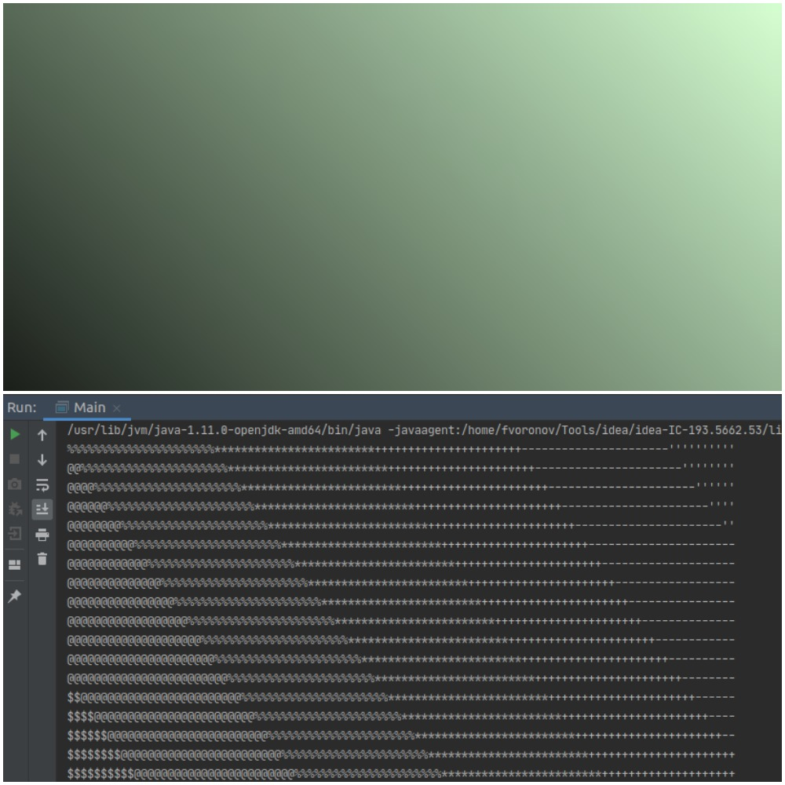

# Конвертер в текстовую графику

Проект создания приложения, умеющего скачивать картинки по URL и конвертировать изображения в
текстовую графику (т. е. текст из разных символов, которые в совокупности выглядят как изображение). Вот пример его
работы (картинка на нём — это текст из мелких символов):

## Требования к конвертеру

Интерфейс конвертера требует от него иметь возможность выставлять ему определённые настройки перед конвертацией:

- Можно установить максимально допустимое соотношение сторон (ширины и высоты); если метод не вызывали, то любое
  соотношение допустимо;
- Можно установить максимально допустимую высоту итогового изображения; если метод не вызывали, то любая высота
  допустима;
- Можно установить максимально допустимую ширину итогового изображения; если метод не вызывали, то любая ширина
  допустима;
- Можно установить текстовую цветовую схему — объект специального интерфейса, который и будет отвечать за превращение
  степени белого (числа от 0 до 255) в символ; если метод не вызывали, то должен использоваться объект написанного вами
  класса как значение по умолчанию.

Помните, что в джаве `String` это текст, а необязательно всего одна строчка текста. Т.е. в один объект типа `String`
можно занести многострочный текст,
а разделителем строк (по сути Enter-ом) будет спецсимвол, который пишется в коде как `\n`. В итоге, у вас в конце каждой
строчки текстового изображения будет находится символ переноса строки (запись в коде - `\n`).

Пример работы конвертера, результат работы которого выводим в консоль:  
В итоге мы видим такой результат, где более тёмные участки заменяются на более "жирные" символы, а светлые на более
незаметные символы:

## Требования к цветовой схеме

Предлагается список символов от самых «тёмных» к самым «светлым»: '▇', '●', '◉', '◍', '
◎', '○', '☉', '◌', '-'. Если вы программируете на винде, то рекомендуем другой список из более стандартных символов,
иначе может отрисовываться криво: '#', '$', '@', '%', '*', '+', '-', '\''. В зависимости от переданного значения
интенсивности белого, должен выбираться соответствующий символ. Например, если значение близко к 0, то выбрать надо '▇';
если к 255, то '-'. Если где-то посередине, то и выбирать надо тоже где-то посередине.

